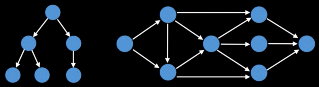

# Graphs
A **graph** is an abstract data type that implements graph concepts from the field of graph theory.

**Graph theory** is the mathematical theory of the properties and applications of graphs (networks).

## Types of Graph
### Undirected Graph
A undirected graph is a graph in which edges have no orientation. The edge *(u, v)* is identical
to the edge *(v, u)*.

### Directed Graph (Digraph)
A directed graph or digraph is a graph in which edges have orientations (arrows). The edge *(u, v)*
is the edge from node *u* to node *v*.

### Weighted Graphs
Many graphs (either directed or undirected) can have edges that contain a certain weight to 
represent an arbitrary value such as cost, distance, quantity, etc. 

A edge *(u, v, w)* is an edge where *u* = source, *v* = destination and *w* = weight.

### Special Graphs
#### Tree
A **tree** is an *undirected graph with no cycles*, as it is a connected graph with N nodes and N-1 
edges.

#### Rooted Tree
A **root tree** is a tree with a *designated root node* where every edge either points away from or 
towards the root node. When edges point away from the root (most common) we call the graph an
 *arborescence (out-tree)* and *anti-arborescence (in-tree)* otherwise.

 
#### Directed Acyclic Graphs (DAGs)
A **directed acyclic graph (DAGs)** is a *directed graphs with no cycles*. These graphs play an
important role in representing structures with dependencies. Several efficient algorithms exist to
operator on DAGs. Spark for example, uses DAGs to manage job execution task dependencies.

#### Bipartite Graph
A **bipartite graph** is one whose vertices can be split into two independent groups *U, V* such
that every edge connects between U and V.

Other definitions exist such as: the graph is two colourable or there is no odd length cycle.

#### Complete Graph
A **complete graph** is one where there is a unique edge between every pair of nodes. A complete
graph with *n* vertices is denoted as the graph *Kn*.

  
## Representing Graphs
Deciding which data structure we use to represent a graph can have a huge impact on performance, so
let's go through a few options.

### Adjacency Matrix
A adjacency matrix *m* is a very simple way to represent a graph. The idea is that the cell 
`m[i][j]` represent the edge weight of going from node `i` to node `j`. As a consequence, it is 
often assumed that going from a node to itself has a cost of zero.

**Pros**:
- Space efficient for representing dense graphs;
- Edge weight lookup is O(1);
- Simplest graph representation.

**Cons**:
- Requires O(V^2) space, hence it is less space efficient for sparser graphs.
- Iterating over all edges takes O(V^2) time

### Adjacency List
An adjacency list is a way to represent a graph as a map from nodes to lists of edges. Each entry
carries all of its outgoing edges.

**Pros**:
- Space efficient for representing sparse graphs;
- Iterating over all edges is efficient.

**Cons**:
- Less space efficient for denser graphs;
- Edge weight lookup is O(E);
- Slightly more complex graph representation.

### Edge List
An edge list is a way to represent a graph simply as an unordered list of edges, where the notation
for any triplet *(u, v, w)* is the cost from node *u* to node *v* is *w*. This representation is 
however seldomly used because of its lack of structure, in any case, it is concenptually simple and
practical in a handful of algorithms.

**Pros**:
- Space efficient for representing sparse graphs;
- Iterating over all edges is efficient;
- Very simple structure.

**Cons**:
- Less space efficient for denser graphs;
- Edge weight lookup is O(E).

## Problems in Graph Theory
Questions to ask before working on a solution for a graph problem:
1. Is the graph directed or undirected?
2. Are the edges weighted?
3. Is the graph likely to be sparse or dense?
4. Which data structure I should use to represent it efficiently?

### Shortest Path
**Problem**: given a weighted graph, find the shortest path of edges from node A to node B.
**Solutions**: BFS (unweighted graph), Dijkstra's, Bellman-Ford, Floyd-Warshall, A*, etc.

### Connectivity
**Problem**: does there exist a path between node A and node B?
**Solutions**: union find data structure or any search algorithm (e.g DFS).

### Negative Cycles
**Problem**: does my weighted digraph have any negative cycles? If so, where?
**Solutions**: Bellman-Ford and Floyd-Warshall.

### Strongly Connected Components (SCC)
**Problem**: self-contained cycles within a directed graph where every vertex in a given cycle can 
reach every other vertex in the same cycle.
**Solutions**: Tarjan's and Kosaraju's algorithm.

### Traveling Salesman
**Problem**: given a list of cities and the distances between each pair of cities, what is the
shortest possible route that visits each city exactly once and returns to the origin city?
**Solutions**: Held-Karp, branch and bound, and many approximation algorithms.

### Bridges
**Problem**: a bridge/cut edge is any edge in a graph whose removal increases the number of 
connected components.

### Articulation Points
**Problem**: an articulation point/cut vertex is any node in a graph whose removal increases the
number of connected components.

### Minimum Spanning Tree (MST)
**Problem**: subset of the edges of a connected, edge-weighted graph that connects all the vertices
together, without any cycles and with the minimum possible total edge weight.
**Solutions**: Krustal's, Prim's & Boruvka's algorithm.

### Network Flow: Max Flow
**Problem**: with an infinite input source how much "flow" can we push through the network?